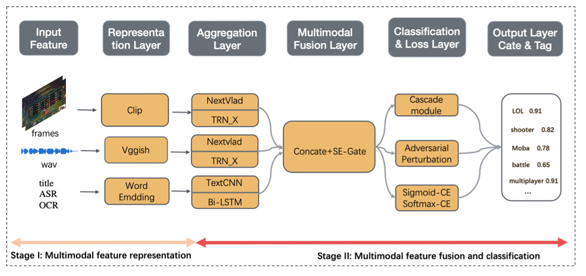
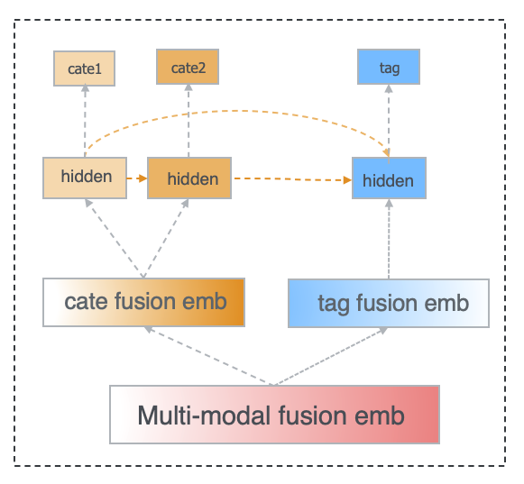
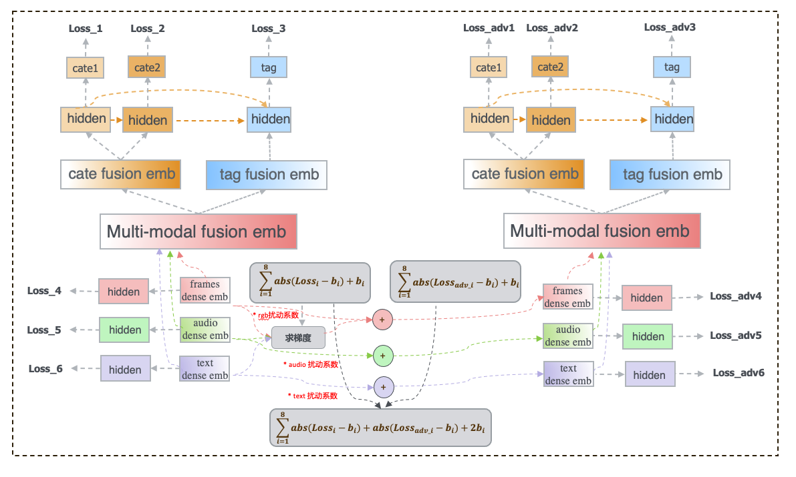

# 2021-CCKS-Trace14-3rd-semantic-tag-classification


### 0、背景

```
1、官网： CCKS 2021：知识增强的视频语义理解
https://www.biendata.xyz/competition/ccks_2021_videounderstanding/

2、官方 baseline: 
https://github.com/PaddlePaddle/Research/tree/master/KG/DuKEVU_Baseline
```


### 1、环境

```
pip install -r requirements.txt
```


### 2、训练 & 测试

```
1、训练

cd shell/
sh train_cate1_cate2_tag.sh

2、测试
cd shell/
sh infer_cate1_cate2_tag.sh

```


### 3、实验指标


#### 3.1  Video-classify-tag

​															      Table 1.      Video-classify-tag metrics details

| Task \ Metrics |   Accuracy    |          |               |                    |                        |
| :------------: | :-----------: | :------: | :-----------: | :----------------: | :--------------------: |
|     Model      | Baseline_cate | Our-base | Our-base +CCM | Our-base  +CCM+APM | Our-base  +CCM+APM+MTM |
|  Cate level 1  |     0.620     |  0.742   |     0.754     |       0.778        |         0.781          |
|  Cate level 2  |     0.450     |  0.583   |     0.595     |       0.616        |         0.619          |

 

#### 3.2  Video-sementic-tag


​																	 Table 2.   Video-sementic-tag metrics details

|  Metrics\model  | Baseline_tag              (all tag) | Our-base | Our-base +CCM | Our-base  +CCM+APM | Our-base  +CCM+APM+MTM |
| :-------------: | :---------------------------------: | :------: | :-----------: | :----------------: | :--------------------: |
| Tag   Precision |                0.586                |  0.471   |     0.465     |       0.474        |         0.478          |
|   Tag Recall    |                0.222                |  0.217   |     0.236     |       0.264        |         0.267          |
|  Tag F1-scores  |                0.322                |  0.297   |     0.313     |       0.339        |         0.3426         |


### 4、整体框架



​																	figure1. Proposed framework for semantic tags clasification


#### 4.1 Cascade Module (CCM)



#### 4.2  Adversarial Perturbation Module (APM)


